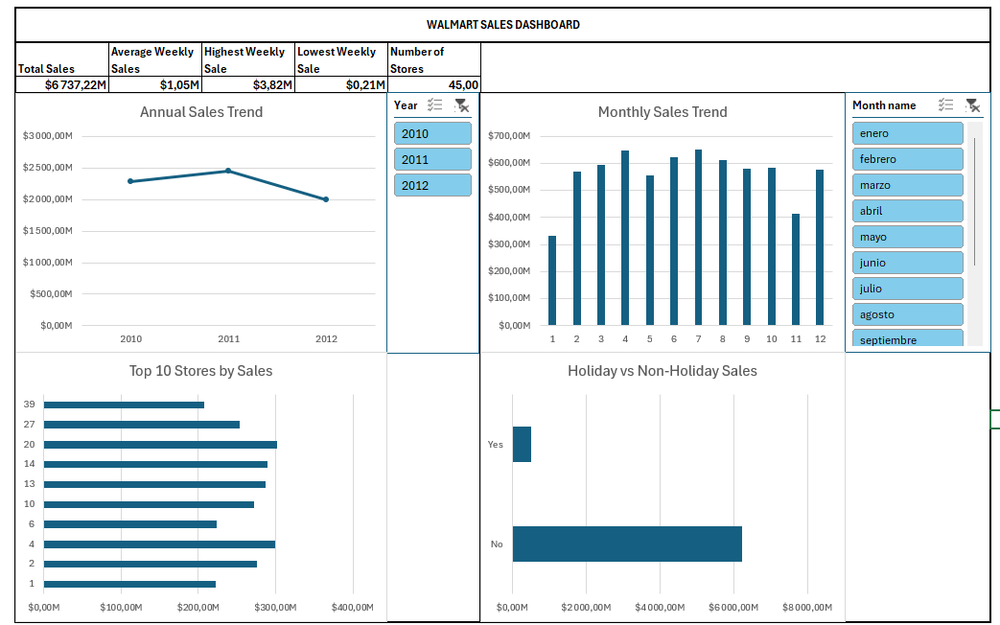

# 📊 Walmart Sales Dashboard (Excel)

An interactive sales dashboard developed in Microsoft Excel using Power Query, Pivot Tables, Pivot Charts, and Slicers.



---

# 📌 Overview

This project analyzes Walmart weekly sales data to provide business insights through an interactive dashboard. The dashboard allows users to explore sales performance by year, month, store, and holiday periods through dynamic filters and visualizations.

---

# 🎯 Objectives

- Clean and transform raw sales data using Power Query.
- Create meaningful KPIs for business monitoring.
- Build an interactive executive dashboard.
- Enable dynamic analysis through slicers and Pivot Charts.

---

# 🛠️ Tools Used

- Microsoft Excel
- Power Query
- Pivot Tables
- Pivot Charts
- Slicers
- Data Cleaning
- Dashboard Design

---

# 📈 Key Performance Indicators

- Total Sales
- Average Weekly Sales
- Highest Weekly Sale
- Lowest Weekly Sale
- Number of Stores

---

# 📊 Dashboard Features

- Annual Sales Trend
- Monthly Sales Trend
- Top 10 Stores by Sales
- Holiday vs Non-Holiday Sales
- Interactive filters by Year and Month

---

# 📂 Dataset

**Source:** Walmart Dataset by Yasser H.

https://www.kaggle.com/datasets/yasserh/walmart-dataset

---

# 📁 Repository Structure

```
dashboard/
│   Walmart_Sales_Dashboard.xlsx

data/
│   Walmart.csv

images/
│   dashboard.png

README.md
```

---

# 👨‍💻 Author

**Daniel Alejandro Delgado Moreno**

Electrical Engineering Student

Exchange Student at the University of São Paulo (USP)

National University of Colombia
